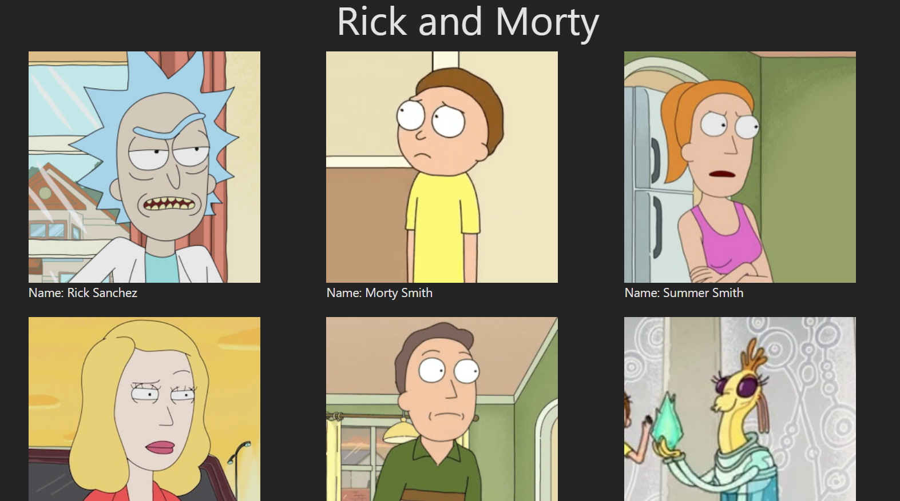

# Basic React Project

This project is for training only. This project using React Hooks (useState and useEffect) to fetch data from Rick and Morty API and then show the data to a grid layout with Tailwindcss.

## Preview



## How to Run this Project (Manual/Docker)

### Manually
1. Clone this project
```
git clone https://github.com/mdavindarinaldy/fgo24-react-hooks.git
```
2. Install dependencies
```
npm install
``` 
3. Run the project
```
npm run dev
```
4. Project will running on http://localhost:5173

### With Docker
1. Clone this project
```
git clone https://github.com/mdavindarinaldy/fgo24-react-hooks.git
```
2. Build image
```
docker build . -t ubuntu:hooks
```
3. Run image with docker
```
docker run -p 8080:80 -d ubuntu:hooks
```
4. Project will be running on http://localhost:8080

## Dependencies
This project using node.js to run, make sure to install node on your machine. Other than that, this project also using Vite, React and ESLint.

## Basic Information
This project is part of training in Kodacademy Bootcamp Batch 24 made by Muhammad Davinda Rinaldy
